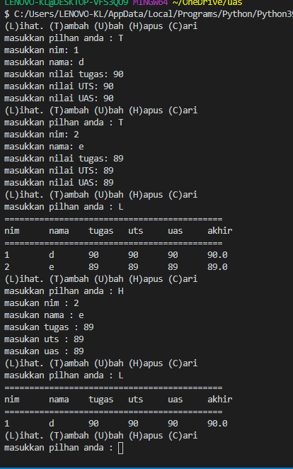

# Tugas pertemuan ke 9
Repository ini digunakan untuk memenuhi Ujian Akhir Semester<br>

Nama    : Dani Darmawan <br>
NIM     : 312010154 <br>
KELAS   : TI.20.B1 <br>
## input_nilai.py 
``` python
nim = []
nama = []
tugas = []
uts = []
uas = []
akhir = []
pilihan = True

def tambah():
    nim1 = input("masukkan nim: ")
    nim.append({'nim': nim1})
    nama1 = input("masukkan nama: ")
    nama.append({'nama': nama1})
    tugas1 = input("masukkan nilai tugas: ")
    tugas.append({'tugas': tugas1})
    uts1 = input("masukkan nilai UTS: ")
    uts.append({'uts': uts1})
    uas1 = input("masukkan nilai UAS: ")
    uas.append({'uas': uas1})
    akhir1 = 0.3 * float(tugas1) + 0.35 * float(uts1) + 0.35 * float(uas1)
    akhir.append({'akhir': akhir1})
    pilihan == False
```
fungsi modul di atas yaitu untuk menampung data yang nantinya datanya akan di gunakan oleh modul ([daftar_nilai.py](model/daftar_nilai.py)<br>

## daftar_nilai.py
```python
from view.input_nilai import *

def ubah():
    milih = input("masukkan data yang akan diubah : ")
    if milih == "nim":
        nim3 = str(input("masukkan nim :"))
        nim4 = str(input("masukkan nim yang baru :"))
        for i in range(len(nim)):
            if nim3 == nim[i]['nim']:
                nim[i]['nim'] = nim4
    elif milih == "nama":
        nama3 = str(input("masukkan nama :"))
        nama4 = str(input("masukkan nama yang baru :"))
        for i in range(len(nama)):
            if nama3 == nama[i]['nama']:
                nama[i]['nama'] = nama4
    elif milih == "tugas":
        tugas3 = str(input("masukkan nilai tugas :"))
        tugas4 = str(input("masukkan nilai tugas yang baru :"))
        for i in range(len(tugas)):
            if tugas3 == tugas[i]['tugas']:
                tugas[i]['tugas'] = tugas4
    elif milih == "uts":
        uts3 = input("masukkan nilai uts :")
        uts4 = input("masukkan nilai uts yang baru :")
        for i in range(len(uts)):
            if uts3 == uts[i]['uts']:
                uts[i]['uts'] = uts4
    elif milih == "uas":
        uas3 = str(input("masukkan nilai uas : "))
        uas4 = input("masukkan nilai uas yang baru :")
        for i in range(len(uas)):
            if uas3 == uas[i]['uas']:
                uas[i]['uas'] = uas4

def hapus():
    nim3 = input("masukan nim : ")
    for i in range(len(nim)):
        if nim3 == nim[i]['nim']:
            del nim[i]
    nama3 = input("masukan nama : ")
    for i in range(len(nama)):        
        if nama3 == nama[i]['nama']:
             del nama[i]
    tugas3 = input("masukan tugas : ")
    for i in range(len(tugas)):         
        if tugas3 == tugas[i]['tugas']:
            del tugas[i]
    uts3 = input("masukan uts : ")
    for i in range(len(uts)):        
        if uts3 == uts[i]['uts']:
             del uts[i]
    uas3 = input("masukan uas : ")
    for i in range(len(uas)):         
        if uas3 == uas[i]['uas']:
             del uas[i]     

def keluar():
    print("pilihan yang anda masukkan tidak ada")
```
dalam modul ini terdapat beberapa syntax yang hasilnya akan di tampilkan pada modul  ([view_nilai.py](view/view_nilai.py)<br>
``` python
from view.input_nilai import *
```
fungsi ini menandakan baha data yang diambil berasal dari modul ([input_nilai.py](view/input_nilai.py)<br>
view. = nama folder<br>
input_nilai = nama file<br>
fungsi tanda * untuk mengimport semua data yang ada pada modul tersebut<br>

## view_nilai.py
```python
from view.input_nilai import *

def lihat():
    print("============================================")
    print("nim \t nama \t tugas \t uts \t uas \t akhir")
    print("============================================")
    for i in range(len(nim)):
        print(nim[i]['nim'], '\t', nama[i]['nama'], '\t', tugas[i]['tugas'], '\t', uts[i]['uts'], '\t',uas[i]['uas'], '\t', akhir[i]['akhir'], '\t')
        ops = False

def cari():
    cari = input("masukan data yang dicari : ")
    if cari == "nim":
        for i in range(len(nim)):
            print(nim[i]['nim'])
    elif cari == "nama":
        if cari == "nama":
            for i in range(len(nama)):
                print(nama[i]['nama'])
    elif cari == "tugas":
        if cari == "tugas":
            for i in range(len(tugas)):
                print(tugas[i]['tugas'])
    elif cari == "uas":
        if cari == "uas":
            for i in range(len(uas)):
                print(uas[i]['uas'])
    elif cari == "uts":
        if cari == "uts":
            for i in range(len(uts)):
                print(uts[i]['uts'])
    elif cari == "akhir":
        if cari == "akhir":
            for i in range(len(akhir)):
                print(akhir[i]['akhir'])
    else:
            print("data yang anda cari tidak ada")

```
dalam modul ini berfungsi sebagai menampilkan data<br>


## main.py

```python
from model.daftar_nilai import *
from view.input_nilai import *
from view.view_nilai import  *

while pilihan !=0:
    print("(L)ihat.", "(T)ambah", "(U)bah", "(H)apus", "(C)ari")
    pilihan = input("masukkan pilhan anda : ")
    if pilihan == "T":
        tambah()
    elif pilihan == "L":
        lihat()
    elif pilihan == "U":
        ubah()
    elif pilihan == "H":
        hapus()
    elif pilihan == "C":
        cari()
    else:
        keluar()
        break
```
Modul ini adalah akhir / finalnya karna pada modul ini program dapat dijalankan<br>
digunakannya perulangan karna terdapat banyak perintah yang akan dijalankan<br>

## Screenshoot
